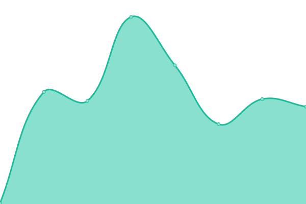
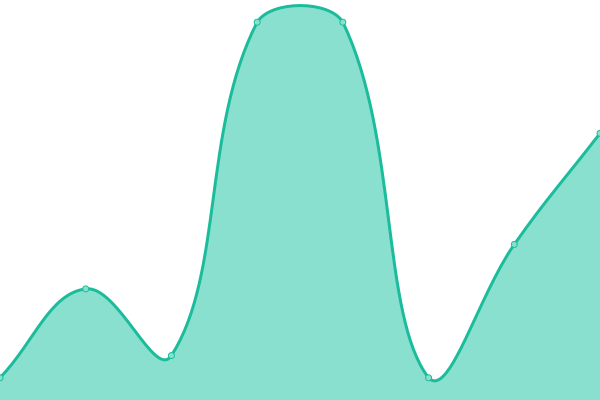
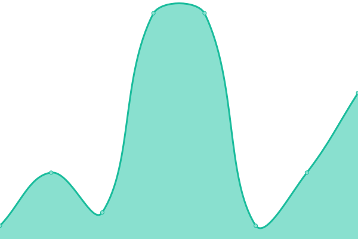
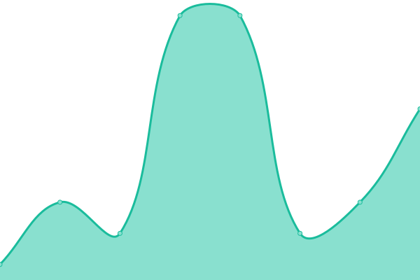
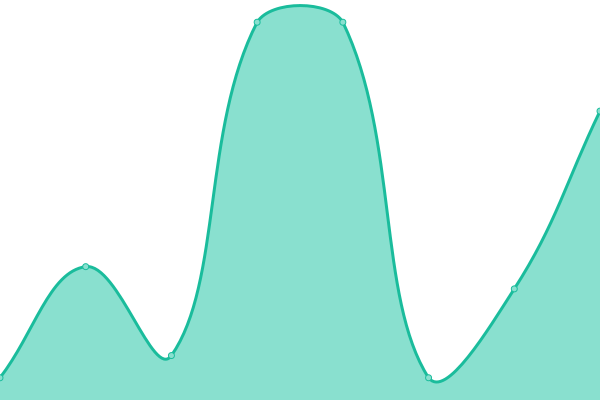

# [📈 Live Status](https://elara-aerospace.github.io/elara-status): <!--live status--> **🟧 Partial outage**

This repository contains the open-source uptime monitor and status page for [Elara Aerospace](https://elara-aerospace.com/), powered by [Upptime](https://github.com/upptime/upptime).

With [Upptime](https://upptime.js.org), you can get your own unlimited and free uptime monitor and status page, powered entirely by a GitHub repository. We use [Issues](https://github.com/elara-aerospace/elara-status/issues) as incident reports, [Actions](https://github.com/elara-aerospace/elara-status/actions) as uptime monitors, and [Pages](https://elara-aerospace.github.io/elara-status) for the status page.

<!--start: status pages-->
<!-- This summary is generated by Upptime (https://github.com/upptime/upptime) -->
<!-- Do not edit this manually, your changes will be overwritten -->
<!-- prettier-ignore -->
| URL | Status | History | Response Time | Uptime |
| --- | ------ | ------- | ------------- | ------ |
|  [Website](https://elara-aerospace.com) | 🟩 Up | [website.yml](https://github.com/elara-aerospace/elara-status/commits/HEAD/history/website.yml) | 

 221ms
     
 | 

<a href="https://status.elara-aerospace.com/history/website">100.00%</a>
    

|  [GitHub Repositories](https://github.com/elara-aerospace) | 🟩 Up | [git-hub-repositories.yml](https://github.com/elara-aerospace/elara-status/commits/HEAD/history/git-hub-repositories.yml) | 

 473ms
     
 | 

<a href="https://status.elara-aerospace.com/history/git-hub-repositories">100.00%</a>
    

|  [GitHub DNS (185.199.108.153)](185.199.108.153) | 🟩 Up | [git-hub-dns-185-199-108-153.yml](https://github.com/elara-aerospace/elara-status/commits/HEAD/history/git-hub-dns-185-199-108-153.yml) | 

 4ms
     
 | 

<a href="https://status.elara-aerospace.com/history/git-hub-dns-185-199-108-153">100.00%</a>
    

|  [GitHub DNS (185.199.109.153)](185.199.109.153) | 🟩 Up | [git-hub-dns-185-199-109-153.yml](https://github.com/elara-aerospace/elara-status/commits/HEAD/history/git-hub-dns-185-199-109-153.yml) | 

 4ms
     
 | 

<a href="https://status.elara-aerospace.com/history/git-hub-dns-185-199-109-153">100.00%</a>
    

|  [GitHub DNS (185.199.110.153)](185.199.110.153) | 🟩 Up | [git-hub-dns-185-199-110-153.yml](https://github.com/elara-aerospace/elara-status/commits/HEAD/history/git-hub-dns-185-199-110-153.yml) | 

 5ms
     
 | 

<a href="https://status.elara-aerospace.com/history/git-hub-dns-185-199-110-153">100.00%</a>
    

|  [GitHub DNS (185.199.111.153)](185.199.111.153) | 🟩 Up | [git-hub-dns-185-199-111-153.yml](https://github.com/elara-aerospace/elara-status/commits/HEAD/history/git-hub-dns-185-199-111-153.yml) | 

 4ms
     
 | 

<a href="https://status.elara-aerospace.com/history/git-hub-dns-185-199-111-153">100.00%</a>
    

|  [Hetzner (Windows Lite server)](static.48.70.216.95.clients.your-server.de) | 🟩 Up | [hetzner-windows-lite-server.yml](https://github.com/elara-aerospace/elara-status/commits/HEAD/history/hetzner-windows-lite-server.yml) | 

 133ms
     
 | 

<a href="https://status.elara-aerospace.com/history/hetzner-windows-lite-server">100.00%</a>
    

|  [Hetzner (Windows High Performance server)](static.178.4.243.136.clients.your-server.de) | 🟥 Down | [hetzner-windows-high-performance-server.yml](https://github.com/elara-aerospace/elara-status/commits/HEAD/history/hetzner-windows-high-performance-server.yml) | 

 0ms
     
 | 

<a href="https://status.elara-aerospace.com/history/hetzner-windows-high-performance-server">0.00%</a>
    

|  [LRZ server](https://cc.lrz.de) | 🟥 Down | [lrz-server.yml](https://github.com/elara-aerospace/elara-status/commits/HEAD/history/lrz-server.yml) | 

 0ms
     
 | 

<a href="https://status.elara-aerospace.com/history/lrz-server">0.00%</a>
    

<!--end: status pages-->

[**Visit our status website →**](https://elara-aerospace.github.io/elara-status)

## 📄 License

- Powered by: [Upptime](https://github.com/upptime/upptime)
- Code: [MIT](./LICENSE) © [Anand Chowdhary](https://anandchowdhary.com), supported by [Pabio](https://pabio.com)
- Data in the `./history` directory: [Open Database License](https://opendatacommons.org/licenses/odbl/1-0/)
